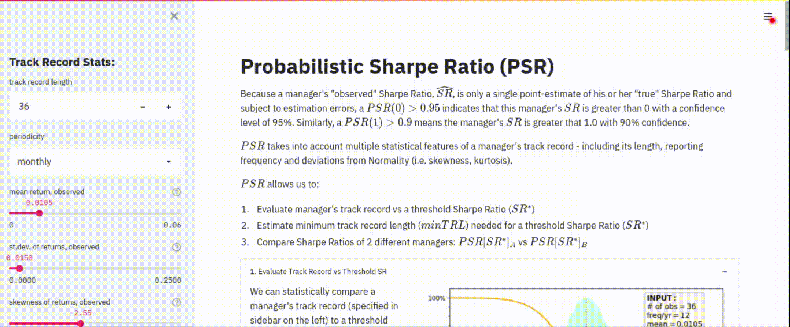

# Probabilistic Sharpe Ratio

Simple Streamlit app to demonstrate PSR applications in evaluating portfolio managers' performance.



### Public App Hosting

A version is available at [Heroku](https://prob-sharpe-app.herokuapp.com/).

### Running Streamlit App Locally

You can run the app locally via:
```sh
streamlit run psr_streamlit_app.py
```
...both "psr_streamlit_app.py" and "PSR.py" should be in the same directory.

### References

Bailey, David H. and López de Prado, Marcos, *The Sharpe Ratio Efficient Frontier*, 2012: available at [SSRN](https://ssrn.com/abstract=1821643).

[Rubén Briones](https://github.com/rubenbriones/Probabilistic-Sharpe-Ratio) has a GitHub repository with additional PSR examples.
